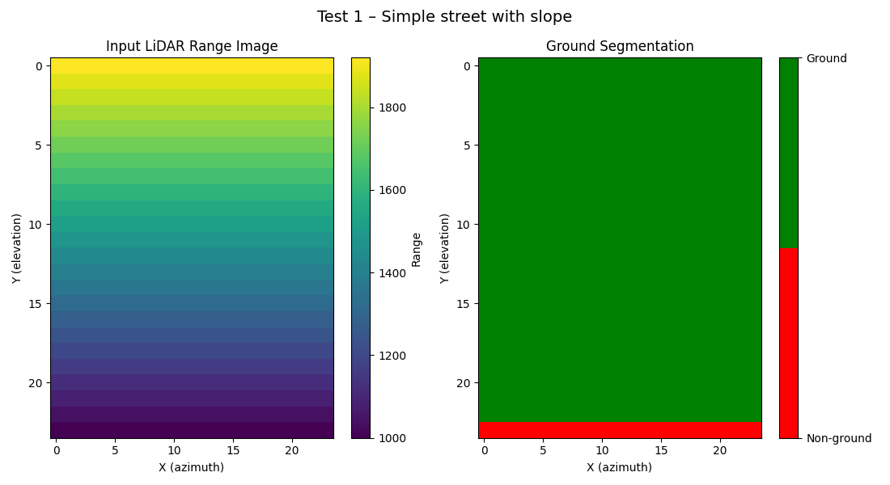
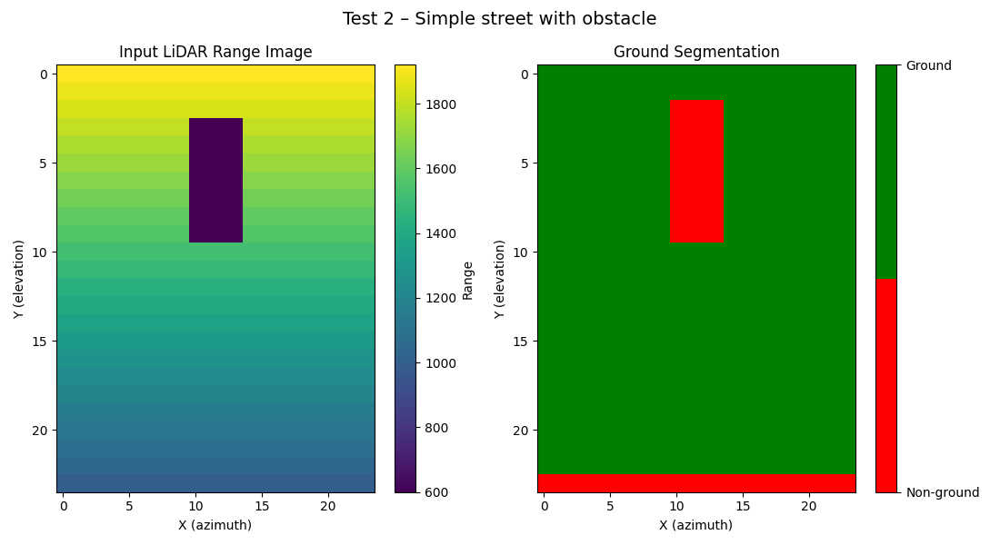
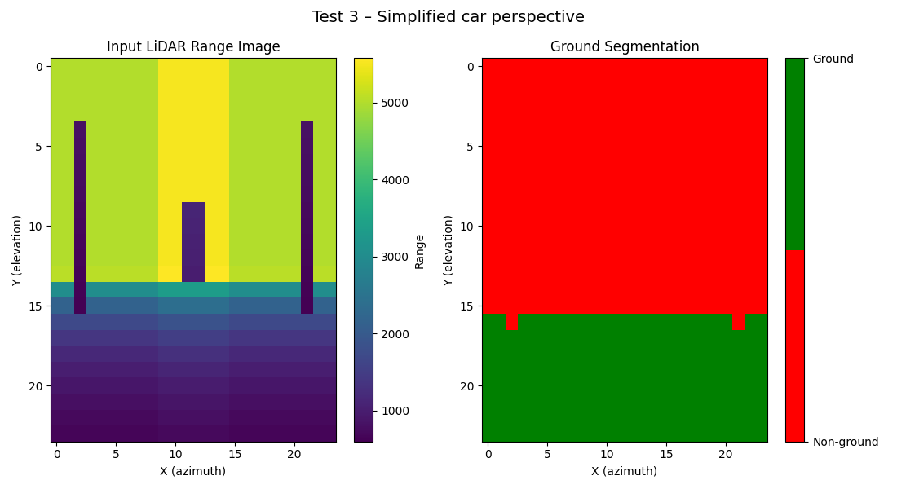
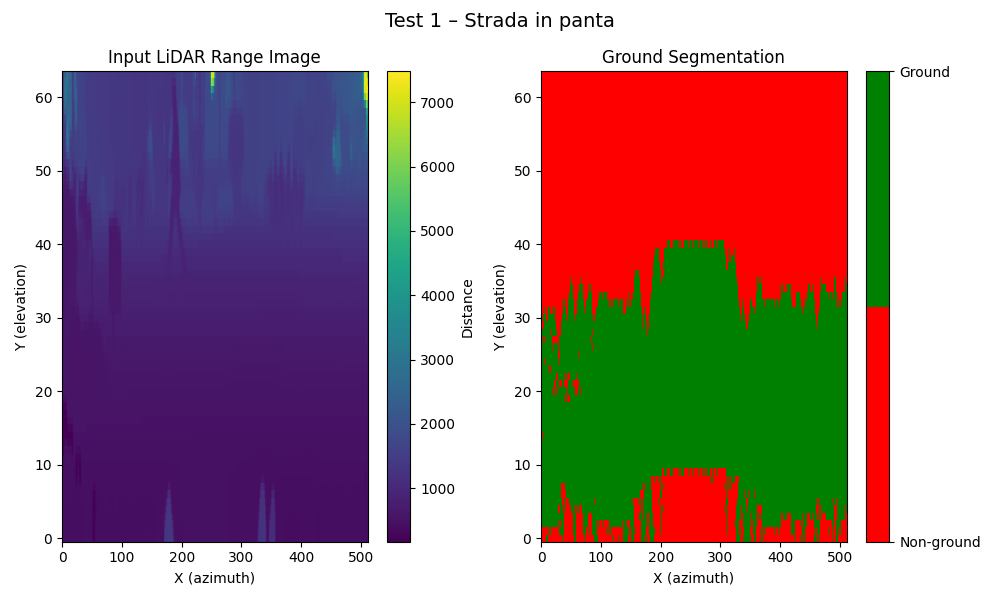

# FPGA-Oriented LiDAR Ground Plane Detection and Segmentation

## Overview
This repository contains a hardware-oriented implementation of a ground plane detection and segmentation algorithm for LiDAR data. The algorithm operates on LiDAR range images and produces a binary ground mask, distinguishing ground points from non-ground obstacles.

The design is implemented in VHDL and verified through simulation using a dedicated testbench. Both synthetic test cases and simplified real-world LiDAR scenarios are used for validation. Visualization and post-processing are performed using Python.

---

## Objective
The objective of this project is to implement a LiDAR ground plane detection and segmentation algorithm in hardware using VHDL, targeting FPGA-based systems. The project includes a complete verification environment, detailed documentation, and reproducible build and simulation scripts.

---

## Algorithm Description
The algorithm processes a 2D LiDAR range image and classifies each pixel as ground or non-ground. The main processing stages are:

- Vertical hole filling to reduce missing measurements in the range image
- Ground seed detection based on local slope constraints
- Iterative flood-fill propagation to expand ground regions while preserving obstacle boundaries

The output is a binary ground mask where ground pixels are marked with `1` and non-ground pixels with `0`.

---

## Hardware Architecture
The design is structured to be hardware-friendly by operating on fixed-size range images and using local neighborhood operations. The implementation uses fixed-point arithmetic and deterministic memory access patterns, making it suitable for FPGA deployment.

Although the current version is verified through simulation, the architecture can be further optimized for real-time FPGA execution through pipelining and sequential control.

---

## Repository Structure
```
src/     - VHDL source files (ground segmentation implementation)
tb/      - VHDL testbench for verification
txt/     - Input range images and output ground masks (text format)
python/  - Python scripts for visualization and post-processing
Makefile - Build and simulation automation script
```

---

## Build and Simulation Instructions
Build and simulation are fully automated using a **Makefile** and **GHDL**.

From the root directory of the project, run:

```bash
make sim
```
This command:
- Compiles the VHDL source files
- Compiles the testbench
- Elaborates and runs the simulation

To run the simulation with waveform generation:
```
make sim-wave
```
Simulation outputs (input matrices and ground masks) are written to the `txt/` directory.

---

## Testbench and Verification
The verification of the proposed architecture is performed using a VHDL testbench. Two categories of range images are used in order to evaluate both functional correctness and hardware feasibility.

Firstly, **artificially generated range images of size 24×24** are employed. These synthetic inputs are specifically designed to match the constraints of the proposed FPGA-oriented architecture and allow fast simulation and verification. This configuration represents the intended operational mode of the design and is suitable for real-time execution on FPGA.

Secondly, an additional experiment is conducted using a **range image derived from real LiDAR data from the KITTI dataset**. Due to hardware and simulation constraints, only a **partial region (approximately one quarter of the original range image)** is used. While this test provides valuable insight into the behavior of the algorithm on real-world data, it requires a significantly longer simulation time and does **not meet real-time execution constraints** in its current form.

This dual testing strategy allows the validation of both the correctness of the algorithm and the practicality of the proposed hardware architecture.


---

## Test Scenarios
The following test scenarios are included in the testbench:

- **Artificial road with longitudinal slope (24×24)**  
  A synthetic range image used to validate ground continuity and slope handling. This test represents a configuration that can be executed in real time on FPGA using the proposed architecture.

- **Artificial road with a central obstacle (24×24)**  
  A synthetic scenario modeling a vehicle or obstacle placed on the road. This test verifies correct separation between ground and non-ground regions and is suitable for FPGA deployment.

- **Artificial range image approximating real LiDAR geometry (24×24)**  
  A manually constructed range image, hardcoded directly in the testbench, designed to imitate the geometric structure of a real LiDAR range image while being scaled down to a small resolution. This scenario preserves key characteristics such as depth gradients, vertical structures, and ground–object separation, while remaining compatible with FPGA constraints.

- **Partial real LiDAR range image (KITTI dataset)**  
  A reduced region extracted from a real KITTI LiDAR frame, used to evaluate the behavior of the algorithm on real-world data. Due to the increased computational cost, this test is intended for functional validation only and does not satisfy real-time constraints.

---

## Results and Visualizations
The results of the proposed ground segmentation algorithm are evaluated visually using representative test scenarios. For each scenario, the input LiDAR range image and the corresponding ground segmentation mask are displayed side by side.

The visualizations confirm that the algorithm correctly identifies ground regions while preserving non-ground obstacles, consistent with the expected geometric structure of the scenes.

### Road with Longitudinal Slope
The slope test demonstrates correct ground continuity across the vertical direction. The algorithm successfully labels the entire road surface as ground, while maintaining a smooth transition across increasing depth values.



### Road with Central Obstacle
In this scenario, a synthetic obstacle is placed on the road surface. The results show that the algorithm correctly separates the obstacle from the ground, preventing flood-fill propagation through non-ground regions.



### Artificial LiDAR-like Range Image
This test uses a manually constructed range image designed to approximate the geometry of a real LiDAR scan while being scaled down to a 24×24 resolution. The algorithm preserves the expected separation between ground and vertical structures, confirming its robustness under realistic geometric patterns.



### Partial Real LiDAR Data (KITTI)
A reduced region extracted from a real KITTI LiDAR frame is used for functional validation. While the algorithm produces meaningful ground segmentation results, the increased input size leads to significantly longer simulation times, highlighting the limitations with respect to real-time execution.



---

## Limitations and Future Work
The current implementation is fully combinational and validated mainly on small range images (24×24), which are compatible with the proposed FPGA-oriented architecture. Processing larger range images derived from real LiDAR data significantly increases simulation time and does not meet real-time constraints.

Future work includes redesigning the architecture using pipelined or sequential processing, supporting higher-resolution range images, and evaluating the design through FPGA synthesis and hardware measurements.

---

## Tools and Technologies
- **VHDL** for hardware description
- **GHDL** for simulation and verification
- **Python** (NumPy, Matplotlib) for visualization
- **LiDAR range images** inspired by the KITTI dataset

---

## References
- KITTI Vision Benchmark Suite  
- Literature on LiDAR ground plane detection and segmentation


